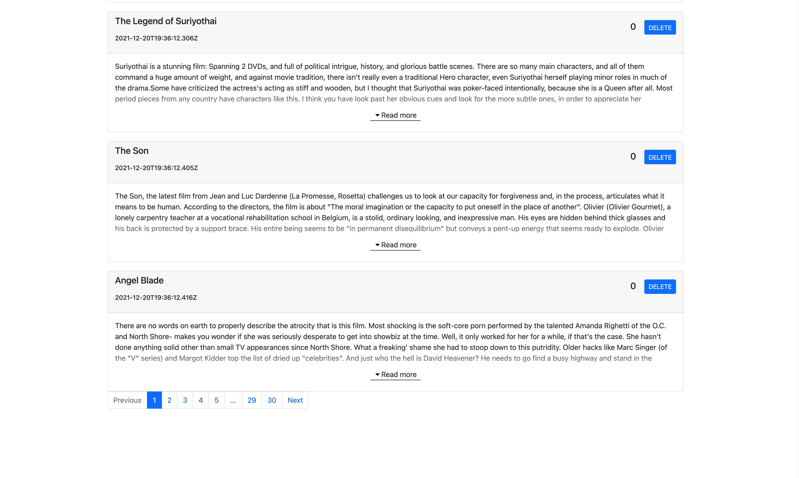

1. This is a movie rating and commenting website for customer to track their watched movie and share experience about movies.

2. Backend was bulit by Java(JDK1.8), SpringBoot, SpringMVC, JWT, MongoDB with JPA ORM.

3. Frontend was bulit by JavaScript, HTML, CSS, React, and realted technologies.

4. Recommend system was bulit by Python, Annoy(Approxiamte Nearest Neighbors), using nearest-neighbor-search algorithm.

Website demo:
  1. Login and Reigster:

  2. Main Page:

  3. Sorting and Seaching function:

  4. User profile and functions:

  5. Recommand system:

  6. rating and commenting functions:

